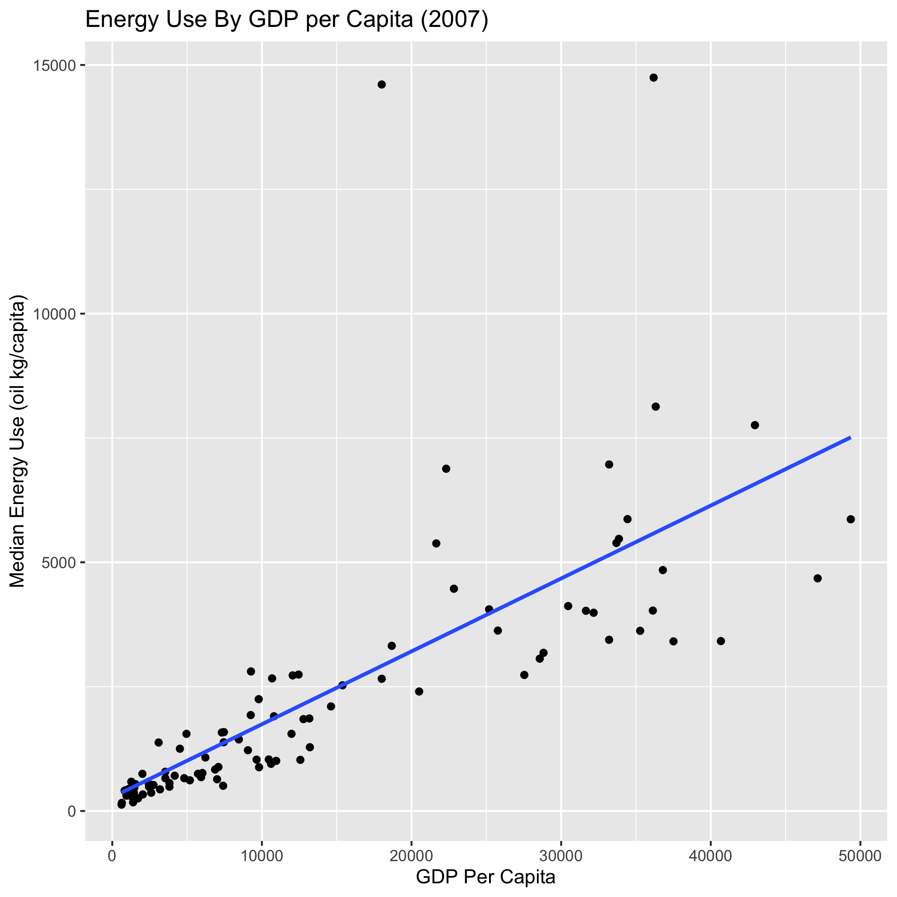
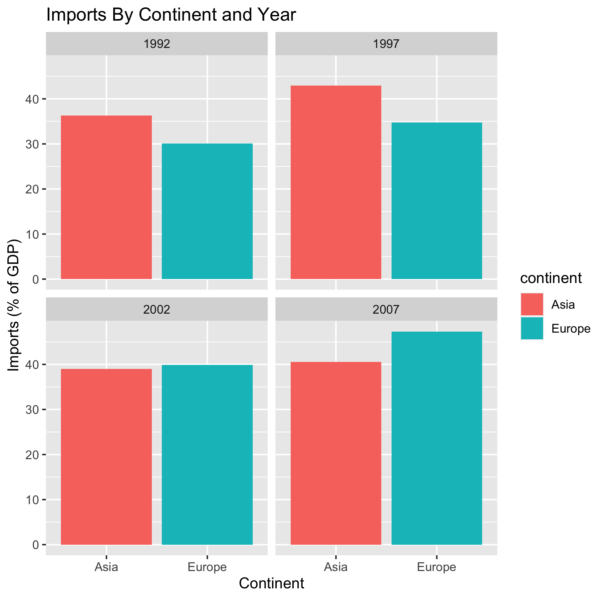
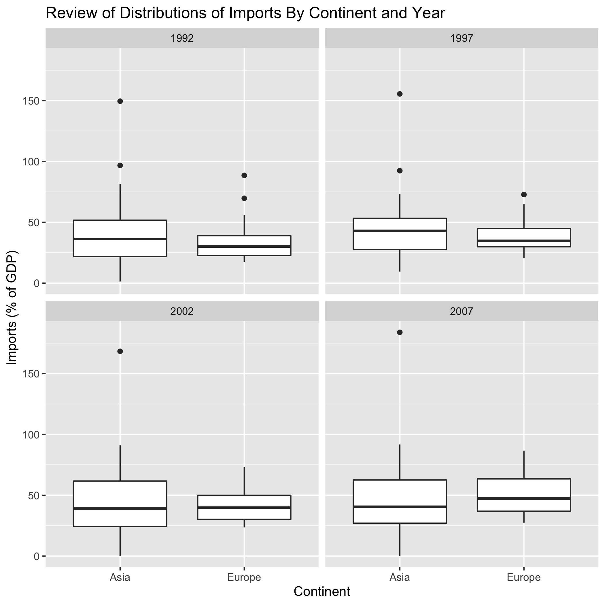
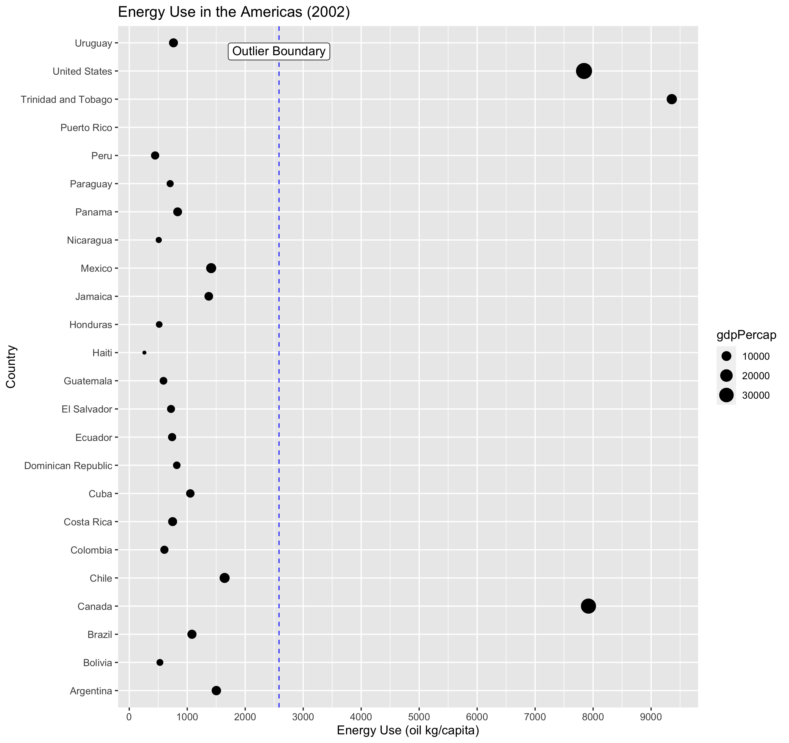
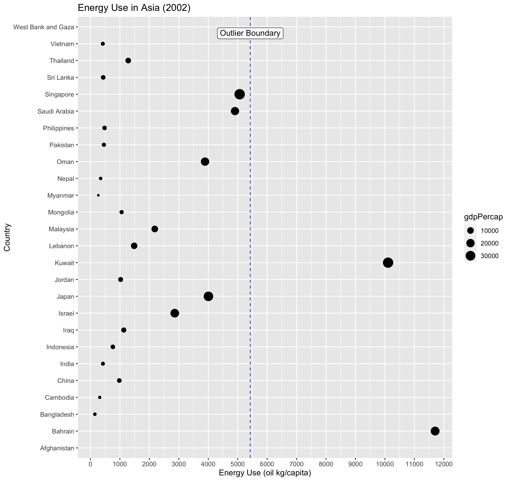

```{r setup, include=FALSE}
knitr::opts_chunk$set(echo = TRUE)
```

### Overview
This report details an analysis of the GapMinder data, containing various economic statistics for countries across the world, from 1962 to 2007

### Question 1 - Relationship Between Continents and Energy Use 

There was a distinct difference in energy use between continents, as there was a strong link between GDP Per Capita and energy usage (Graph 1). Continents with a lot of developed nations such as Europe and Oceania consistently had higher energy usage through the period 1962-2007. Energy usage also increased for most continents over time.

{width=48%}

### Question 2 - Difference between Europe and Asia Imports after 1990 
Imports were compared between European and Asian imports were compared from 1992 to 2007. There are four sets of data, spaced 5 years apart. Each year was analysed separately to determined if there was a significant difference in imports. No such difference was found.

{width=48%}
{width=48%}
### Question 3
TODO

### Question 4
TODO

### Appendix - Analysis Details

#### Question 1 - Details

##### Issue 1: Missing Data in Oldest Records
From 1962 to 1967, both Americas and the Asian continents data only included developed nations such as USA, Canada and Japan, leading to very high median energy usages. From 1972, less developed nations energy usage data was added, leading to large drops in median energy usage for Asia and the Americas.

##### Issue 2: High variability of data by continent
A review of the energy use by continent revealed that several continents contained developed nations from the [G12](https://en.wikipedia.org/wiki/Group_of_Twelve), all of which have much higher energy usage than developing nations. These nations represented outliers, making the median a better measure for all summary statistics.

The graphs below demonstrate the issue of developed and developing countries in Asia and the Americas for a single year.
{width=48%}
{width=48%}

#### Question 2 - Details

The data was split by year into imports from Asia and Europe. For each year, tests of variance and normality were carried out.
the data sets for each year where found to be of non-normal distribution and heteroscedastic.

Attempts at data transformation did not have an effect on distribution.

For these reasons, the non-parametric Wilcoxon Rank Sum Test was used to assess if there was a significant difference in imports
between European and Asian continents.

##### Variance Test
 The following code was used on a subset of the the data (eurasia), which only contained data from Europe and Asia.
```
# test variance across all years
for(Y in seq(from=1992, to=2007, by=5)){
  asia <- eurasia %>% filter(continent=="Asia", Year==Y) %>% select(imports)
  europe <- eurasia %>% filter(continent=="Europe", Year==Y)  %>% select(imports)
  bt <- var.test(asia$imports, europe$imports)
  if (bt$p.value > 0.05){
    print(paste("Year ", Y, " - Samples Have Same Variance p=", bt$p.value))
  }else{
    print(paste("Year ", Y, " - Samples Have Different Variance p=",bt$p.value))
  }
}

  [1] "Year  1992  - Samples Have Different Variance. p= 0.00176955623068187"
  [1] "Year  1997  - Samples Have Different Variance. p= 8.32979264644429e-05"
  [1] "Year  2002  - Samples Have Different Variance. p= 2.99103533047962e-05"
  [1] "Year  2007  - Samples Have Different Variance. p= 0.000334177202574004"
```

##### Population Distribution Test
The following code was used on a subset of the the data (eurasia), which only contained data from Europe and Asia.

```
for(Y in seq(from=1992, to=2007, by=5)){
  asia <- eurasia %>% filter(continent=="Asia", Year==Y) %>% select(imports)
  europe <- eurasia %>% filter(continent=="Europe", Year==Y)  %>% select(imports)
  shap_asia <- shapiro.test(asia$imports)
  shap_europe <- shapiro.test(europe$imports)

  if (shap_asia$p.value < 0.05){
    # accept H1 - Not a Normal Dist.
    print(paste("Year ", Y, " - Sample is Not Normal Dist p=", shap_asia$p.value))
  }else{
    # accept Ho - Dist IS Normal
    print(paste("Year ", Y, " - Sample is Normal Dist p=", shap_asia$p.value))
  }

  if (shap_europe$p.value < 0.05){
    # accept H1 - Not a Normal Dist.
    print(paste("Year ", Y, " - Sample is Not Normal Dist p=", shap_europe$p.value))
  }else{
    # accept Ho - Dist IS Normal
    print(paste("Year ", Y, " - Sample is Normal Dist p=", shap_europe$p.value))
  }
}

  [1] "Year  1992  - Sample is Not Normal Dist p= 0.00729140350741121"
  [1] "Year  1992  - Sample is Not Normal Dist p= 0.00142220149839726"
  [1] "Year  1997  - Sample is Not Normal Dist p= 0.00130563941784164"
  [1] "Year  1997  - Sample is Not Normal Dist p= 0.014404371185735"
  [1] "Year  2002  - Sample is Not Normal Dist p= 0.000831277264600929"
  [1] "Year  2002  - Sample is Not Normal Dist p= 0.0310031203840743"
  [1] "Year  2007  - Sample is Not Normal Dist p= 0.000555960683937061"
  [1] "Year  2007  - Sample is Normal Dist p= 0.06642536347996"
```

##### Sample Test
The Wilcoxon Rank Sum test was used to confirm or exclude any significant difference in exports for each
year of data collected. The result for all years was that there was no significant difference in exports.

The following code was used on a subset of the the data (eurasia), which only contained data from Europe and Asia.

```
for(Y in seq(from=1992, to=2007, by=5)) {
  asia <- eurasia %>% filter(continent=="Asia", Year==Y) %>% select(imports)
  europe <- eurasia %>% filter(continent=="Europe", Year==Y)  %>% select(imports)
  wt <- wilcox.test(asia$imports, europe$imports)
  print(paste("Year ", Y, " - Wilcoxon Rank Sum. p=",wt$p.value))
}

  [1] "Year  1992  - Wilcoxon Rank Sum. p= 0.491949069483506"
  [1] "Year  1997  - Wilcoxon Rank Sum. p= 0.333042606763002"
  [1] "Year  2002  - Wilcoxon Rank Sum. p= 0.902728315090688"
  [1] "Year  2007  - Wilcoxon Rank Sum. p= 0.400466154282899"
```  
  